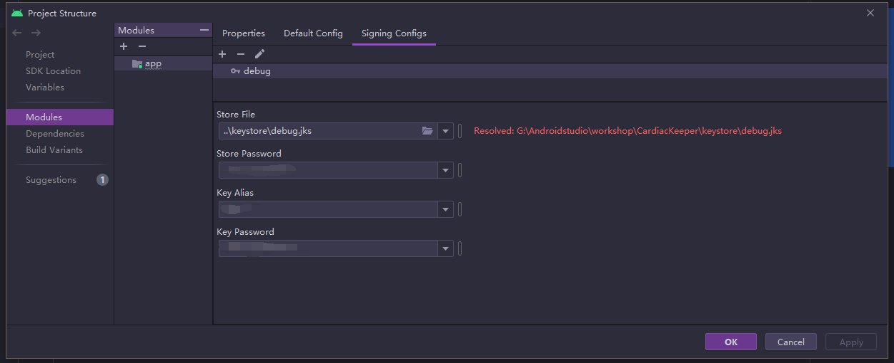

&emsp;&emsp;本篇博客旨在记录我在创建一个安卓前端项目的流程。这些流程中包含一些keystore、规范git操作的内容，记录下之后用于以后翻阅。

&emsp;&emsp;开发IDE为Android Studio，首先按照正常流程创建一个项目。

## 规范git提交内容

&emsp;&emsp;在项目根目录中创建`githook/`文件夹，用于保存项目中要用到的githook。这一步的意义在于，`.git/`文件夹会默认被`.gitignore`文件忽略，所以如果直接在`.git/hook/`文件夹中写入文件将不会被同步。


&emsp;&emsp;由于Android Studio的VSC插件自带了一些例如pre-commit的功能，所以我们只需要对commit-msg进行规定即可。在githook文件夹下创建`commit-msg`文件：
```sh
#!/bin/sh

MSG=$(awk '{printf("%s",$0)}' $1)
if [[ $MSG =~ ^(feature|fix|docs|style|refactor|perf|test|build|ci|chore|revert)\(.*\):.*$ ]]; then
  echo -e "\033[32m commit success! \033[0m"
else
  echo -e "\033[31m Error: the commit message is irregular \033[m"
  echo -e "\033[31m Error: type must be one of [feature,fix,docs,style,refactor,perf,test,build,ci,chore,revert] \033[m"
  echo -e "\033[31m eg: feature(user): add the user login \033[m"
  exit 1
fi
```

## 通过gradle task复制hook

&emsp;&emsp;这一步的目的在于，当在任意设备上运行项目时，都能确保`githook/`的内容都能被复制到`.git/hook/`中。

&emsp;&emsp;在project的`build.gradle`中:
1. 安装idea-ext插件：
```gradle
// 插件：https://github.com/JetBrains/gradle-idea-ext-plugin/wiki#gradle-tasks-triggers-settings
plugins {
    id "org.jetbrains.gradle.plugin.idea-ext" version "1.0.1"
}
```
2. 编写复制文件的task
```gradle
task copyGitHookScriptToLocalDir(type: Copy) {
    from './githooks/'
    into './.git/hooks'
}
```
3. 设置在sync之后执行操作
```gradle
idea.project.settings {
    taskTriggers {
        afterSync tasks.getByName("copyGitHookScriptToLocalDir")
    }
}
```

&emsp;&emsp;这一步为止，我们必须要按照`githook/commit-msg`文件中的格式进行提交，但是人工填写这种格式是很麻烦的，因此需要利用插件来帮我们填写。

## 安装插件`GitCommitMessageHelper`

&emsp;&emsp;这是一个帮助格式化git提交的插件。其提交的格式和commit-msg文件中的要求符合。


&emsp;&emsp;提交格式说明：


&emsp;&emsp;该插件的使用方式略。

## 设置KeyStore
&emsp;&emsp;这一步的目的在于，在项目组中统一使用同一个key去构建项目。

1. 首先生成一个key，该步骤略。

2. 在根目录下创建`keystore/`文件夹，并将上一步生成的key放入其中。

3. 在app的`build.gradle`中添加`signingConfigs`：
```gradle
android {
  signingConfigs {
    debug {
      storeFile file('../keystore/debug.jks')
      storePassword 'your storePassword'
      keyAlias 'your keyAlias'
      keyPassword 'your keyPassword'
    }
  }
  ...
}
```
4. 第三步也可以在`File -> Project Structure -> Module`中设置，效果是一致的

